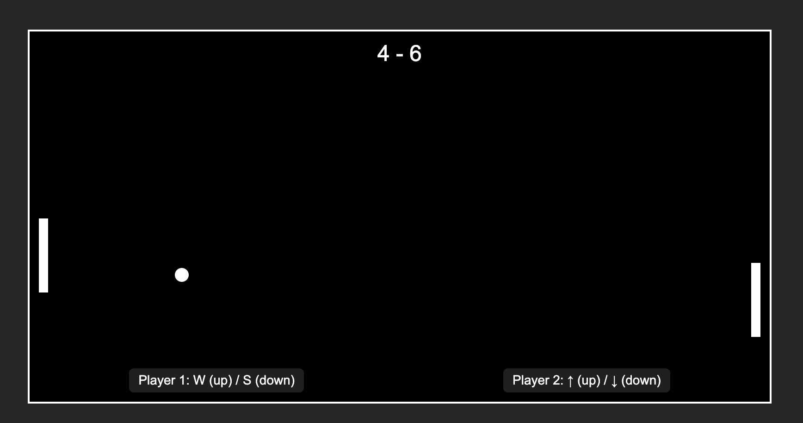

# Building a Classic Ping Pong Game with JavaScript

In this tutorial, we'll explore how to create a classic ping pong game using vanilla JavaScript, HTML, and CSS. This project demonstrates fundamental game development concepts like collision detection, animation, and user input handling.

## Project Overview

Our ping pong game features:
- Two-player gameplay
- Real-time paddle movement
- Ball physics
- Score tracking
- Responsive design





## Implementation Details

### HTML Structure
The game uses a simple HTML structure with three main elements:
- Ball
- Two paddles
- Score display

```html
<div class="game-container">
    <div id="ball"></div>
    <div id="paddle1" class="paddle"></div>
    <div id="paddle2" class="paddle"></div>
    <div id="score">
        <span id="player1Score">0</span> - <span id="player2Score">0</span>
    </div>
</div>
```

### Game Logic

The game logic is organized in a `PingPong` class that handles:

1. **Game State Management**
   - Ball position and velocity
   - Paddle positions
   - Player scores

2. **Movement Controls**
   - Player 1: W/S keys
   - Player 2: Arrow Up/Down keys

3. **Collision Detection**
   - Ball-paddle collisions
   - Wall collisions
   - Scoring detection

### Key Features Explained

#### Ball Movement
The ball moves using a simple physics system:
```javascript
ballX += ballSpeedX;
ballY += ballSpeedY;
```

#### Paddle Control
Paddle movement is handled through keyboard event listeners:
```javascript
if (keys['w'] && paddle1Y > 0) {
    paddle1Y -= paddleSpeed;
}
```

#### Collision Detection
The game checks for collisions between:
- Ball and paddles
- Ball and walls
- Ball passing paddles (scoring)

## How to Play

1. Open index.html in a web browser
2. Player 1 (left) uses W/S keys
3. Player 2 (right) uses Arrow Up/Down keys
4. First to score wins!

## Technical Highlights

1. **RequestAnimationFrame**
   - Used for smooth animation
   - Provides consistent game loop

2. **Event Handling**
   - Keyboard input management
   - Real-time response

3. **DOM Manipulation**
   - Dynamic score updates
   - Element positioning

## Learning Outcomes

Building this game teaches several important programming concepts:
- Game loop implementation
- State management
- Event handling
- DOM manipulation
- Basic physics calculations

## Deployment with GitHub Pages

This game can be easily deployed online using GitHub Pages and GitHub Actions:

1. **Automated Deployment**: The repository includes a GitHub Actions workflow (`.github/workflows/deploy.yml`) that automatically deploys the game to GitHub Pages whenever changes are pushed to the main branch.

2. **Configuration**: The workflow uses GitHub's official Pages actions to build and deploy the static site without any additional build steps.

3. **Access**: Once deployed, the game is accessible at `https://[username].github.io/[repository-name]`

4. **Benefits**: This deployment method provides:
   - Free hosting
   - Automatic updates when code changes
   - Global content delivery
   - No server management required

## Future Enhancements

Possible improvements could include:
- Adding sound effects
- Implementing power-ups
- Creating an AI opponent
- Adding difficulty levels
- Mobile touch controls

## The Prompt Process

This ping pong game was created using an AI assistant with the following prompt workflow:

1. **Initial Request**: "generate a frontend application in js to build a pingpong game"
   - The AI created three core files:
     - index.html (game structure)
     - style.css (game styling)
     - game.js (game logic)

2. **Blog Creation**: "also write a blog about it in a file"
   - The AI generated this blog post explaining the implementation

3. **Image Addition**: "update the image inside the blog md"
   - A placeholder image was added to visualize the game

4. **Process Documentation**: "also export the prompt process to the blog"
   - This section was added to document how the project was created

5. **GitHub Pages Setup**: "how can i host it to github actions?"
   - GitHub Actions workflow was created for automatic deployment
   - README was added with setup instructions

6. **Game Improvements**: "add instructions to press w and s for player 1 and also keyboard keys for player 2 also highlight active player color"
   - Added on-screen instructions for controls
   - Implemented visual feedback for active players
   - Enhanced the user interface

This demonstrates how AI can assist in rapidly prototyping games and creating documentation, allowing developers to focus on enhancing and customizing the implementation.

## Complete Coding Journey

Below is the complete conversation that shows the entire development process of this game:

```
Human: generate a frontend application in js to build a pingpong game

AI: I'll help you create a simple ping pong game using JavaScript. Let's build a frontend application with HTML, CSS, and JavaScript.

First, let's explore the current directory structure to see where we should place our files.

I'll create three files for our ping pong game: index.html for the structure, style.css for styling, and game.js for the game logic.

[Created index.html with game structure]
[Created style.css with game styling]
[Created game.js with game logic]

The game is now ready to play! Just open the index.html file in a web browser to start. The game features:
- Responsive design
- Smooth paddle movement
- Ball physics
- Score tracking
- Simple controls